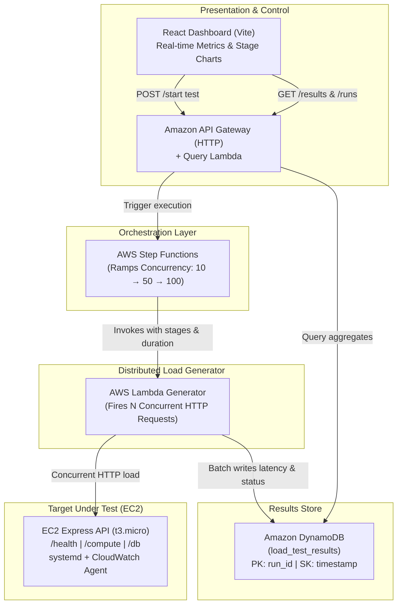

# LoadLite — Self-Hosted AWS Load Testing Platform

> [!CAUTION]
> **CLOSED-LOOP SAFETY NOTICE**
> This platform is strictly designed and authorized for closed-loop load testing against the target application provisioned in this repository under your own AWS account. **NEVER** point this load generator at third-party infrastructure, public web endpoints, or production systems.

---

## 1. System Architecture

LoadLite is an automated, self-contained load benchmarking platform that ramps concurrency across stages and persists granular per-request metrics for analysis.



---

## 2. Components

### 1. Target Application (EC2)
* **Instance Type**: `t3.micro` (Amazon Linux 2023)
* **Runtime**: Node.js 20 Express API running as a resilient `systemd` daemon (`target-app.service`).
* **Endpoints**:
  * `GET /health` — Baseline trivial 200 OK.
  * `GET /compute` — CPU-bound SHA-256 iterative hash loop simulating computationally intensive application workloads.
  * `GET /db` — Writes and reads items to DynamoDB (`load_test_target_data`) via IAM instance profile credentials.
* **Monitoring**: Amazon CloudWatch Agent reporting host CPU and memory utilization.

### 2. Load Generator (AWS Lambda)
* **Function**: `load-test-generator` (Node.js 20.x, 1024 MB RAM, 300s timeout).
* Spawns worker loops maintaining $N$ concurrent in-flight connections.
* Captures high-resolution per-request latency (ms), HTTP response codes, and timestamps.
* Batch-writes items to DynamoDB in chunks of 25 with exponential backoff.

### 3. Concurrency Orchestrator (AWS Step Functions)
* **State Machine**: `load-test-orchestrator`.
* Executes progressive ramp stages (e.g. `[10, 50, 100]`) sequentially.
* Manages a unified `run_id` across all stages with cooling pauses between tiers.

### 4. Metrics & Results Store (Amazon DynamoDB)
* **Table**: `load_test_results` (Pay-per-request / On-Demand).
  * **Partition Key**: `run_id` (String)
  * **Sort Key**: `timestamp` (Number — microsecond-offset epoch preventing concurrent write collisions).
  * **Attributes**: `latency_ms`, `status_code`, `endpoint`, `concurrency_stage`, `created_at`.
* **Table**: `load_test_target_data` (Target app mock data store).

### 5. API Gateway & Interactive Dashboard (React + Vite)
* **API Gateway**: `load-test-api` backed by `load-test-query` Lambda.
  * `GET /runs` — Lists previous runs with summaries.
  * `GET /results?run_id=xxx` — Calculates p50, p90, p95, p99 percentiles, error rates, and second-by-second timelines.
  * `POST /start` — Triggers new Step Functions executions directly from the UI.
* **Dashboard**: Modern glassmorphic dark-mode UI with live stage latency comparison charts and throughput timeline.

---

## 3. Directory Layout

```text
LoadLite/
├── SYSTEM_DESIGN.md        # Original design specifications & requirements
├── README.md               # Architecture documentation & operations guide
├── .gitignore              # Protects .env, state files, and credentials
├── .env.example            # Root environment variable template
├── terraform/              # Infrastructure as Code
│   ├── main.tf             # Provider setup & default tags (project = load-test-platform)
│   ├── variables.tf        # Region, instance sizing, and VPC config
│   ├── vpc.tf              # Default VPC networking
│   ├── dynamodb.tf         # load_test_results and load_test_target_data tables
│   ├── iam.tf              # Scoped least-privilege IAM roles and instance profiles
│   ├── ec2-target.tf       # Target EC2 instance, security group, and user-data
│   ├── lambda.tf           # Load generator & query Lambdas
│   ├── step-functions.tf   # Concurrency ramping state machine
│   ├── api-gateway.tf      # HTTP API Gateway with CORS
│   └── outputs.tf          # Target URLs, Table Names, and API Gateway endpoints
├── target-app/             # Express API target application code
│   ├── server.js           # /health, /compute, and /db routes
│   ├── package.json
│   └── .env.example
├── load-generator/         # Lambda load generator implementation
│   ├── index.js            # Concurrency worker & DynamoDB batch writer
│   ├── package.json
│   └── .env.example
├── lambda-query/           # API Gateway read/trigger Lambda
│   ├── index.js            # Percentile aggregator & Step Functions launcher
│   ├── package.json
│   └── .env.example
└── dashboard/              # React (Vite) frontend application
    ├── src/
    │   ├── App.jsx         # Real-time metrics, charts, & test launcher
    │   ├── index.css       # Obsidian glassmorphic styling
    │   └── main.jsx
    ├── package.json
    ├── .env                # Configured with deployed API Gateway & EC2 URLs
    └── .env.example
```

---

## 4. Quick Start & Deployment

### Prerequisites
* AWS CLI installed and configured with credentials for `load-test-platform-deploy`.
* Terraform `v1.5+`.
* Node.js `v18+`.

### Deploy Infrastructure
```bash
cd terraform
terraform init
terraform apply -auto-approve
```

### Launch the Frontend Dashboard
```bash
cd ../dashboard
npm install
npm run dev
```
Navigate to `http://localhost:5173` to access the dashboard.

---

## 5. Clean Teardown

To destroy all cloud resources and ensure zero residual costs:

```bash
cd terraform
terraform destroy -auto-approve
```
*Guaranteed to cleanly remove EC2 instances, security groups, DynamoDB tables, Lambda functions, Step Functions, and API Gateway without manual console intervention.*
